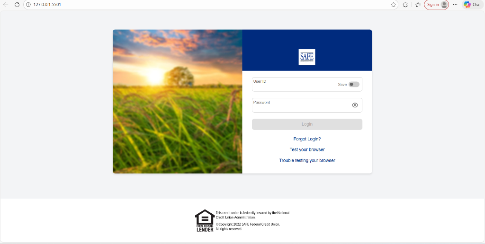

# SAFE Federal Credit Union - Login Page

A modern, responsive login page clone inspired by SAFE Federal Credit Union's online banking portal.

## 📸 Screenshot



## 📁 Folder Structure

```
safefed-login/
├── css/
│   ├── styles.css          # Main entry point - imports all modules
│   ├── variables.css       # CSS custom properties (colors, shadows, fonts)
│   ├── base.css            # Reset & base document styles
│   ├── layout.css          # Main container & card layout
│   ├── header.css          # Login header & logo styles
│   ├── form.css            # Form inputs, labels, password toggle, messages
│   ├── toggle.css          # Toggle switch component
│   ├── button.css          # Login button & loader animation
│   ├── links.css           # Login links styling
│   ├── footer.css          # Footer styles
│   └── responsive.css      # Media queries for tablet/mobile
├── js/
│   └── main.js             # JavaScript for form handling & validation
├── screenshots/
│   └── login-page.png      # Application screenshot
├── index.html              # Main HTML file
└── README.md               # Project documentation
```

## 🔐 Demo Credentials

Use the following credentials to test the login functionality:

| Field     | Value     |
|-----------|-----------|
| User ID   | `admin`   |
| Password  | `123456`  |

## ✨ Features

- **Responsive Design** - Works seamlessly on desktop and mobile devices
- **Form Validation** - Real-time validation for User ID and Password fields
- **Password Toggle** - Show/hide password visibility
- **Save User ID** - Option to remember User ID for future logins
- **Loading State** - Visual feedback during login process
- **Error Handling** - Clear error messages for invalid inputs

## 🚀 Getting Started

1. Clone or download this repository
2. Open `index.html` in your web browser
3. Use the demo credentials above to test the login

### Using Live Server (Recommended)

If you have VS Code with Live Server extension:
1. Right-click on `index.html`
2. Select "Open with Live Server"

## 🛠️ Technologies Used

- **HTML5** - Semantic markup
- **CSS3** - Modern styling with flexbox, gradients, and animations
- **JavaScript (ES6+)** - Form handling and user interactions
- **LocalStorage** - Persisting "Save User ID" preference

## 📝 Notes

- This is a **frontend-only** demo project
- Authentication is simulated with hardcoded credentials
- In a production environment, credentials would be validated against a secure backend API

## 📄 License

This project is for educational and demonstration purposes only.

---

*Created as a UI clone for demonstration purposes. Not affiliated with SAFE Federal Credit Union.*
